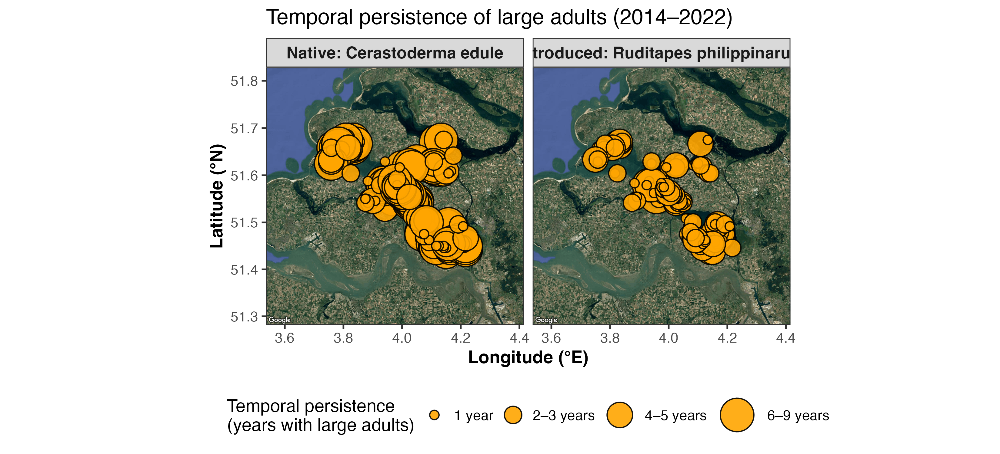

# Spatial and Thermal-Stress Dynamics of Native and Introduced Bivalves in the Eastern Scheldt

This repository provides a unified analytical workflow exploring how **native** and **introduced** bivalves respond to long-term environmental variability and compound climate extremes.  
The pipeline integrates **field surveys**, **spatial distribution mapping**, **persistence analysis**,  
**centroid movement**, **thermal-stress modeling**, and **mesocosm survival experiments**.

Species analyzed:
- **Native cockle** (*Cerastoderma edule*)
- **Introduced Manila clam** (*Ruditapes philippinarum*)

These analyses support and extend the findings in:

> **Zhou et al. (2025)**  
> *Compound extreme events reshuffle the stacked odds in the gamble between native and introduced bivalves*  
> *Global Ecology and Conservation*  
> DOI: https://doi.org/10.1016/j.gecco.2025.e03918

Full pipeline implemented in:
`run_all_bothSpecies.R`

---

# 📘 Background

Long-term benthic surveys (Rijkswaterstaat/WMR, curated by Troost et al.)  
have monitored size, abundance, and distribution of bivalves in the Eastern Scheldt since 1990.  
This project focuses on **2014–2021**, when:

- *R. philippinarum* is fully established throughout the system,  
- KNMI temperature data allow quantification of extreme heat loads,  
- A subset of **111 monitoring stations** contains adult individuals of **both species**,  
  providing a neutral, habitat-controlled basis for comparison.

This dataset complements mesocosm experiments and climate analyses,  
allowing linking **observed patterns** with **mechanistic drivers**.

---

# 🐚 Why Focus on Large Adults?

Juveniles and larvae are **highly stochastic** due to:

- hydrodynamic advection and tidal transport,  
- storm-driven dispersal,  
- unpredictable settlement pulses,  
- and strong environmental filtering at early life stages.

Thus, spatial patterns in small size classes **do not reliably reflect habitat quality**.

By contrast, **large adults**:

- survive ≥ 1–2 winters,  
- integrate multiple seasons of environmental filtering,  
- provide stable spatial signals,  
- and reflect long-term habitat suitability.

Hence, analyses focus on **established adult size/age classes**, which are ecologically interpretable.

---

# Cockle (*Cerastoderma edule*) — Age Classes

| Class | Meaning |
|-------|---------|
| **1j** | 1-year-old juvenile |
| **2j** | 2-year-old |
| **mj** | >2-year adult |
| **nb** | age undetermined |
| *(0j recruits are very rare: n=6 → merged into 1j)* |

**Large adults = 2j + mj**

---

# Manila clam (*Ruditapes philippinarum*) — Size Classes

Clams are classified by shell length, but thresholds changed through time:

| Years | Small (“kln”) | Large (“grt”) |
|-------|----------------|----------------|
| 2014–2017 | <1.5 cm | >1.5 cm |
| 2018–2021 | <2.0 cm | >2.0 cm |

Additional complications:
- **2016:** no size classes recorded  
- **2014, 2017, 2019:** partial size-class labelling  

To maintain consistency, we identify **large adults** as:
**"grt"** across all years  
(2016 excluded for size-based inference).

---

# 🗺️ 1. Spatial Distribution of Large Adults

Large-adult abundance at each station was mapped using a Google satellite basemap.


Large adults cluster in distinct regions of the estuary:

- *C. edule* forms broad intertidal distributions.  
- *R. philippinarum* forms strong, localized aggregations.  

Circle sizes reflect **six abundance classes**, enabling comparison of low to extremely high densities.

---

# 🌄 **2. Adult Habitat Intensity (KDE)**


Kernel-density fields identify **core adult habitats**, revealing:

- Multiple connected hotspots for the native cockle  
- Fragmented, isolated hotspots for the introduced clam  

These differences suggest contrasting habitat strategies between a long-term resident and a relatively recent invader.

---

# ⏳ **3. Temporal Persistence (2014–2022)**



Persistence = **number of years** large adults appear at a station (0–9 years).

Patterns:

- Native cockles show **high-persistence belts**, indicating stable multi-year survival.  
- Manila clams exhibit **shorter-term persistence**, consistent with spatially dynamic expansion after introduction.

---

# 🔄 **4. Range Centroid Shifts (Abundance-Weighted)**


Annual centroid positions track directional movement of each species.

Findings:

- Cockles: oscillatory centroid → stable distribution with interannual variation  
- Manila clams: **consistent southeastward drift** → expansion or thermal tracking  

Circle sizes represent an 8-class global abundance scale (0–25 → >5000 ind.·m⁻²·yr⁻¹).

---

# 🧪 **5. Mesocosm Experiment (Heatwave × Salinity Stress)**


To mechanistically explain field patterns, a controlled mesocosm experiment  
simulated compound extreme events: **multi-day heatwaves × low salinity**.

The system includes:

- recirculating seawater,  
- thermal control (20→40°C blocks),  
- fine/coarse sediment mosaic,  
- diel cycling mimicking environmental rhythms.

---

# ☠️ **6. Survival Differences & the “Establishment Window”**


Using `sr_2sp.csv` and `establish_window.R`, mortality curves reveal:

- *R. philippinarum* → higher tolerance to combined heat + low salinity  
- *C. edule* → sharp mortality collapse under compound extremes  

A **species-specific establishment window** emerges (5–15 PSU; moderate heat stress)  
where introduced clams survive but cockles do not.

This explains:

- clam encroachment into stressful fringe habitats,  
- asymmetric resilience under heat extremes,  
- climate-driven invasion opportunities.

# 🌡️ **7. Abundance Response to Summer Temperature Extremes**


Following **Zhou et al. (2025)** and **Troost et al. (2021)**, we quantify interannual thermal stress by summing:

$$
\sum \bigl(\mathrm{TX} - 23.7^\circ\mathrm{C}\bigr)
$$

where 23.7 °C is the **90th percentile** of daily maximum temperature.

Because benthic surveys occur in spring (Apr–May),  
**summer heat load in year *t*** is matched to **adult abundance in year *t + 1***, capturing:

- Carry-over mortality (mass die-offs during extreme heatwaves)
- Recruitment failures
- Thermal filtering of adults and juveniles

### **Contrasting species responses:**

| Species | Slope | t-value | p-value |
|--------|-------|---------|---------|
| *C. edule* | **negative** | –1.07 | 0.332 |
| *R. philippinarum* | **positive** | 2.65 | 0.045 ✓ |

Interpretation:

- Native cockles show *no significant trend*, though high thermal-load years (e.g., 2018) correspond to well-documented **>90% mortality events** (Troost et al. 2021).
- The introduced Manila clam shows a **significant positive response**, indicating **greater resilience or opportunistic advantage** under thermal extremes.

This contrast aligns with results in Zhou et al. (2025):  
**compound heat events reshuffle competitive outcomes**, favoring the introduced species.

---

# 📦 **Reproducing the Workflow**

Run the full pipeline:

```r
source("run_all_bothSpecies.R")
```

This script produces:
- abundance_bothSpecies_google_6classes.png
- habitat_intensity_bothSpecies_google.png
- temporal_persistence_bothSpecies_google.png
- centroid_shift_clean_bothSpecies_globalScale_8classes.png
- twoSps_tempSum.png

# 📘 **Citation**

If using this workflow, please cite:

Zhou et al. (2025).
Compound extreme events reshuffle the stacked odds in the gamble between native and introduced bivalves.
Global Ecology and Conservation.
DOI: https://doi.org/10.1016/j.gecco.2025.e03918

And acknowledge the long-term monitoring dataset curated by Troost et al. (Rijkswaterstaat / WMR).

---

# 📜 **Usage, Permissions, and Redistribution**

The scripts, analyses, figures, and derived conceptual models in this repository are intended **solely for academic and non-commercial research**.

- **Commercial use**, including incorporation into proprietary tools, platforms, or consulting products, **requires explicit written permission** from the authors.
- **Public reposting or redistribution** of figures, scripts, or processed data (e.g., on websites, media articles, reports, or presentations outside academic contexts) likewise **requires prior approval**.
- The original long-term monitoring dataset is curated by **Rijkswaterstaat / WMR (Troost et al.)** and may be subject to additional usage restrictions.

For permissions or inquiries, please contact the corresponding author listed in the associated publication:

**Zhou et al. (2025)** –  
*Compound extreme events reshuffle the stacked odds in the gamble between native and introduced bivalves.*  
*Global Ecology and Conservation*  
DOI: https://doi.org/10.1016/j.gecco.2025.e03918

For full legal terms, see [LICENSE.md](LICENSE.md).

# 👋 **Contact**

For questions, data access, or collaboration inquiries, please contact the authors of the linked publication.
